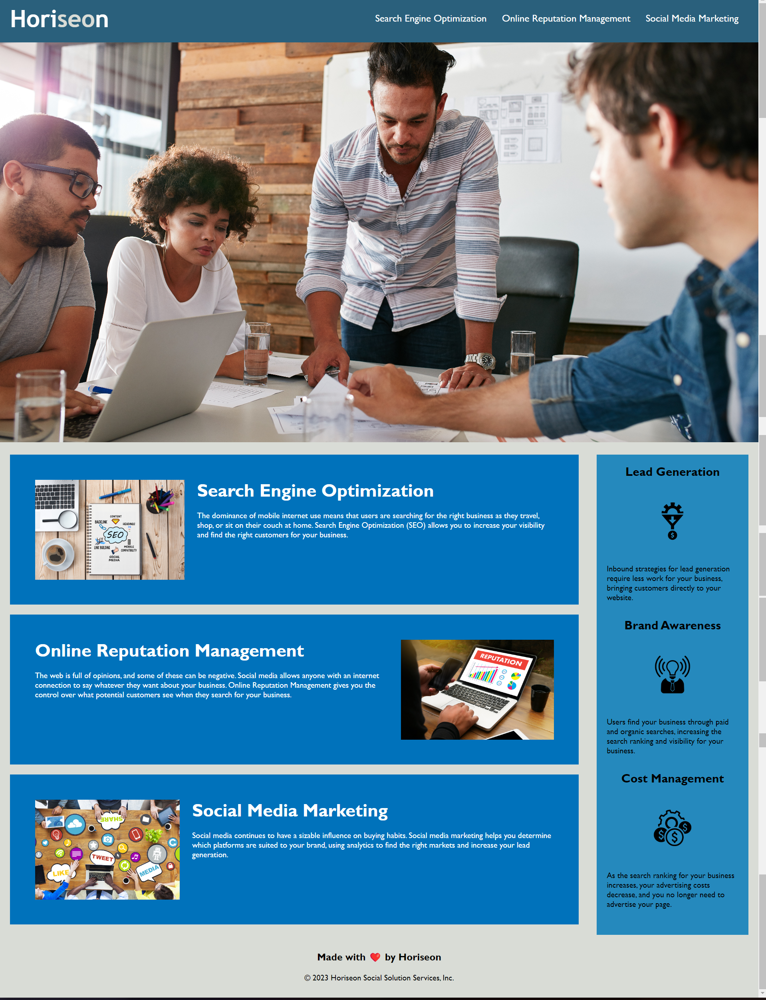

# HoriseonWeb-juliette 
# Description
This project is the Week 1 Module Challenge for the U of M Coding Boot Camp. The challenge emulates a real-world scenario where a developer is assigned the task of enhancing an existing codebase to adhere to accessibility standards. The objective is to optimize the codebase for search engines and enhance accessibility for users with disabilities.

# User Story

As a marketing agency, I require a codebase that conforms to accessibility standards to ensure our website is well-optimized for search engines.

# Acceptance Criteria

The webpage meets rigorous accessibility standards.
Semantic HTML elements are employed consistently throughout the code.
HTML elements are structured logically, independent of styling and positioning.
All icon and image elements include descriptive and accessible alt attributes.
Heading attributes are arranged in sequential order to improve readability and navigation.
The title element provides a concise and descriptive summary of the webpage content.

# Usage

To view the webpage, simply open the index.html file in your preferred web browser.

# Screenshot

# Website
[LINKTOWEBSITE]()

# Contributors

This project was developed by [JULIETTE NGUM].

# Acknowledgement
Thank you to my course instructor[sir Christopher] for his valuable contributions.

# License
This project is licensed under the MIT License.

